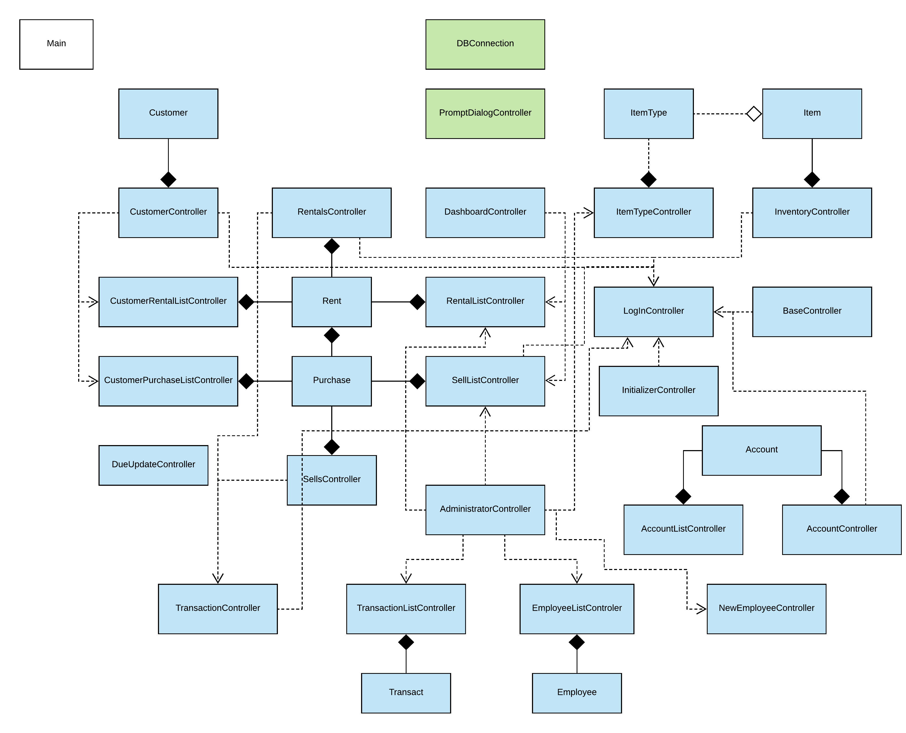
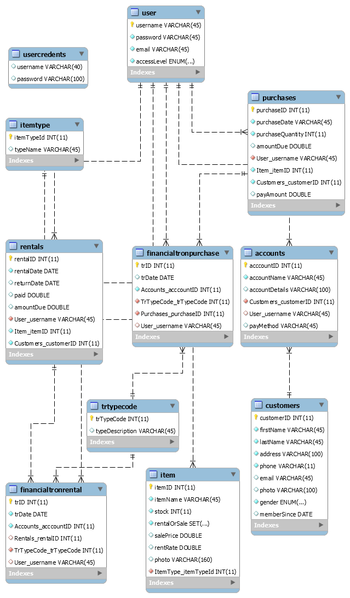
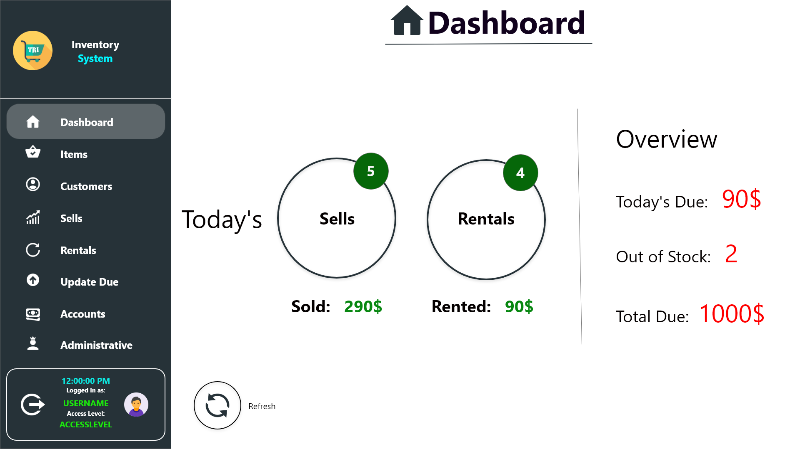
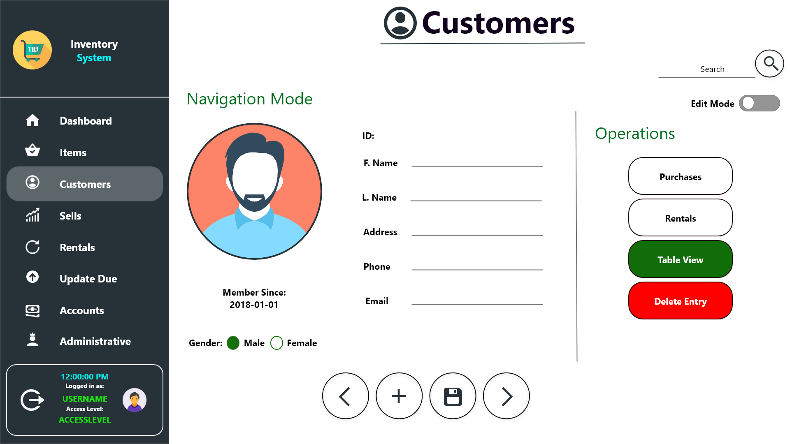

## Inventory Management System 

**Multi-user, RDBMS system for inventory management**
 DCIT 308 semester Project

**Group 5**
 JavaFX, MySQL
 
**Project Name: Shoppy**

**Environment**
- Intellij Idea
- MySQL Workbench 8 on Legacy Mode
- JDK 8
- 

## Installation
1. Make sure **MySQL** is installed properly and running at port **3306** with username **'root'** and password **'root'**
2. Open **MySQL Workbench** and login to your root account
3. From **File** menu click **Open SQL Script**
4. Navigate to: <code>../InventorySystem/sql</code> and select <code>inventory.sql</code> file
5. From **Query** menu select **Execute All** and wait till it finishes
6. Navigate to <code>InventorySystem/jar/</code>
7. Open CMD/Terminal and type: <code>java -jar InventorySystem.jar</code>
9. You're all set!
 
**Watch this video for more:**

## Features
- Dashboard
- Multi-level Access Privilege
- Auto Due Update
- Elegant UI and Robust Visualization
- Relational Database Oriented System
- Multi-threaded

## CAUTION
- MySQL Workbench should be installed in port **3306** with username **'root'** and password **'root'**
- **JDK 1.8** should be installed and available to system path

## Project Skeleton
UML Class Diagram:

Databse Schema:

Prototypes:

 

